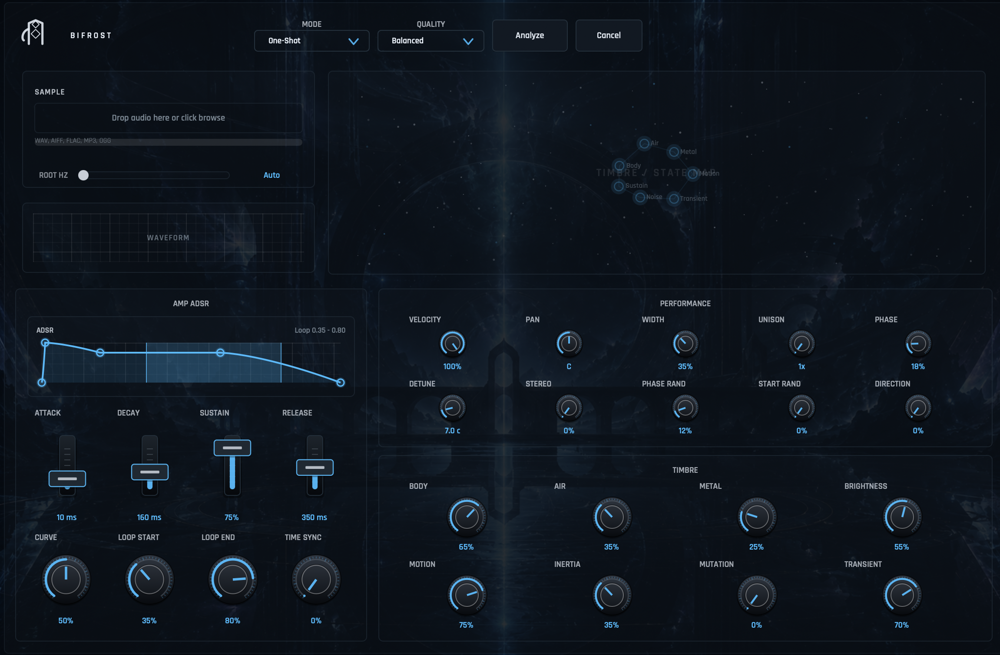

bifrost is a JUCE-based VST3 resynthesis instrument
it lets you drop in an audio sample, analyzes its pitch, harmonics, noise, transients, tempo, and timbre states, then turns that material into a playable synth-style instrument.

instead of just replaying a sample, Bifrost extracts spectral/timbre information and uses additive/resonator/noise synthesis to recreate and reshape the sound in real time.

main features

drag-and-drop audio import
STFT-based analysis pipeline
pitch and root detection
harmonic/resonator extraction
noise/transient modeling
tempo analysis
timbre/state map visualization
adsr envelope controls
loop start/end controls
performance controls like velocity, pan, width, unison, detune, stereo, and start randomization
timbre macro controls like Body, Air, Metal, Brightness, Motion, Inertia, Mutation, and Transient
procedural JUCE UI with custom dark Bifrost styling
macOS VST3 build support
windows VST3 CI build support through GitHub Actions

